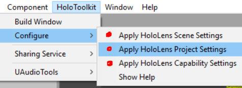
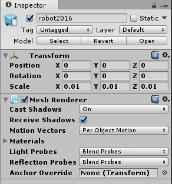
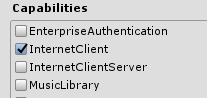
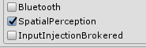
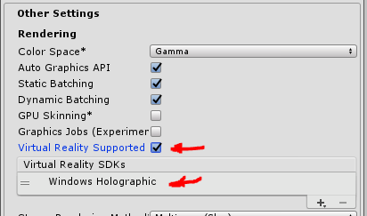
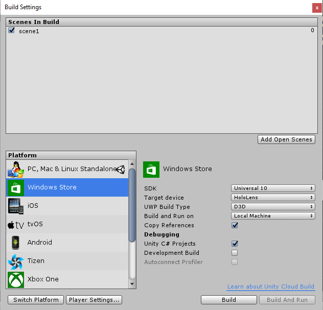

The following is a description of the process to create a Unity project for the
Microsoft HoloLens that allows for the display of an FRC robot CAD drawing as a
hologram. This allows the HoloLens wearer to walk through the robot and examine
the components in detail.

Process summary:
----------------

1.  Simplify your CAD drawing

2.  Export the CAD to OBJ or FBX if possible.

3.  If not, export to STL and then use something like MeshLab or Autodesk
    Meshmixer to convert it to OBJ.

4.  Build a new Unity project, import the HoloToolKit

5.  Import the robot and setup TapToPlace or other features you would like to
    use.

6.  Build and deploy to the Hololens.

Prepare the CAD file.
---------------------

There are likely several ways to go about this depending on what CAD application
you use and what export formats it supports. I basically wanted to get it to an
OBJ or an FBX file in order to import it to Unity. It’s my understanding that an
FBX will retain colors from your CAD but I have only exported to OBJ which
requires me to re-color the graphic once it’s in Unity.

1.  Simplify the drawing by removing some of the non-essentials like screws,
    nuts, bolts, and anything else that makes sense.

2.  Export the drawing. When I exported it to STL format I used a medium quality
    setting. When I tried a high quality setting it was too difficult to work
    with when importing to Unity. You may want to experiment with this and see
    what results you get.

3.  Open the STL file in MeshLab or another tool of choice
    (<http://www.meshlab.net/>).

    1.  Blender (free) may be another good choice for this or AutoDesk Maya, or
        3DS Max if you have a lot of processing power (at least that was my
        experience).

    2.  Depending on the output of this process, you may have issues when
        coloring the model later on. You’ll notice the robot in this project
        ends up with one blue tire as it ended up connected with a part of the
        frame in the sub-components. Someone with more experience may have a
        better process but this was a quick proof of concept project for me. I’m
        sure there’s a lot that can be done here to make the final results
        better.

4.  Use File, Export Mesh As, select OBJ for the file type and provide a file
    name.

Create a new Unity project
--------------------------

Create a new Unity project and make all of the appropriate HoloLens project setting adjustments. See <https://developer.microsoft.com/en-us/windows/holographic/unity_development_overview> for details.

-   You can also get all the correct settings using the Configure options under
    **HoloToolKit** on the top menu:

   

Import the HoloToolkit into the Unity project. Right click on the Assets folder, select Import Package, Custom Package. Select the “HoloToolkit-Unity-v1.5.5.0.unitypackage.” This is the current version as of 2/24/17 and is the basis for the notes below. I unchecked the Example projects so they weren’t imported.

>   See: <https://github.com/Microsoft/HoloToolkit-Unity> and the getting
>   started guide here:
>   <https://github.com/Microsoft/HoloToolkit-Unity/blob/master/GettingStarted.md>

Import the Robot model into Assets:
-----------------------------------

In the project explorer, right click on the Assets folder and select Import New
Asset. Navigate to where you stored the Robot OBJ file and select it to import.
This took about 10 minutes on my Core-i7 laptop. You should see it in the Assets
as a 3D object.

Add the Robot to your scene and setup TapToPlace:
-------------------------------------------------

1.  For an explanation of why we are putting the 3D Robot model inside an empty
    parent see
    <https://forums.hololens.com/discussion/2290/moving-holograms-using-gaze-and-gesture>

2.  Add empty game object to root of your scene hierarchy and name it RobotBase
    or something else meaningful for you. To do this click Create in the
    Hierarchy and select “Create Empty.”

3.  Add your 3D Robot model as a **child** of RobotBase by dragging it from the
    Assets and dropping it on the RobotBase object.

4.  Add a Mesh Renderer component to the 3D Robot model

    1.  Click the Add Component Button, select Mesh, select Mesh Renderer.

5.  Adjust the scale size of the Robot 3D model object. I started with scale
    setting of (.01, .01, .01) and then made adjustments later.

   

6.  Add a 3D box collider as a **component** of RobotBase.

    1.  Click the Add Component Button, select Physics, select Box Collider.

    2.  Size the 3D box collider to slightly larger than the 3D Robot model in
        all dimensions. Be sure to include the Robot model’s origin inside the
        3D box collider area.

7.  Add a Cursor prefab from HTK to the **root** of your scene hierarchy. I used
    the “DefaultCursor”.

8.  Create another empty game object in the root of your screen hierarchy and
    name it Managers or something else meaningful for you.

9.  Add the WorldAnchorManager script from HTK as **component** of Managers

10.  Add the GazeManager script from HTK as **component** of Managers

11.  Add the GestureInput script from HTK as **component** of Managers

12.  Add the RawInteractionSourcesInput script from HTK as **component** of
    Managers

13.  Add the InputManager script from HTK as **component** of Managers

14.  Add the SpatialMapping prefab from HTK to **root** of the hierarchy. Turn
    off the “Draw Visual Meshes checkbox”.

15. Add TapToPlace script as **component** to RobotBase.

Build Settings:
---------------

Note that the next two steps should be set already if you used the Configure Options from the HoloToolKit top menu as mentioned above.

16.  Open File, Build Settings and click the “Windows Store” tab. Click the
    Player Settings button at the bottom of the screen. In the Inspector, find
    the “Publish Settings” and enable the “**InternetClient”** and
    “**SpatialPerception”** capabilities.

   

   

17.  Also, under Other Settings, Rendering Settings, verify that the “**Virtual
    Reality Supported**” feature is checked and “**Windows Holographic**” is
    listed.

   

18.  In the Build settings, Click the “Add Open Scenes” Button to add your scene
    to the build, verify the Windows Store settings, and click Build.

    

19.  This will prompt for a build folder. Create a new folder if necessary and
     select the folder to continue.

20.  Once complete open the build folder you specified and open the
     projectname.sln file in Visual Studio. Using the top toolbar in Visual
     Studio, change the target from Debug to Release and from ARM to X86. Click
     on the arrow next to the Device button, and select Device for your Hololens
     connected to a USB port (be sure it’s on), or select the HoloLens Emulator
     if you don’t have the device available.

21.  Click Debug -\> Start Without debugging or press Ctrl + F5 to build and
     deploy the project.

Further adjustments would be to add colors and textures to the components of the
3D Robot model, add other objects into the scene (like game objects, etc.), and
adjust the size and location of the model.
